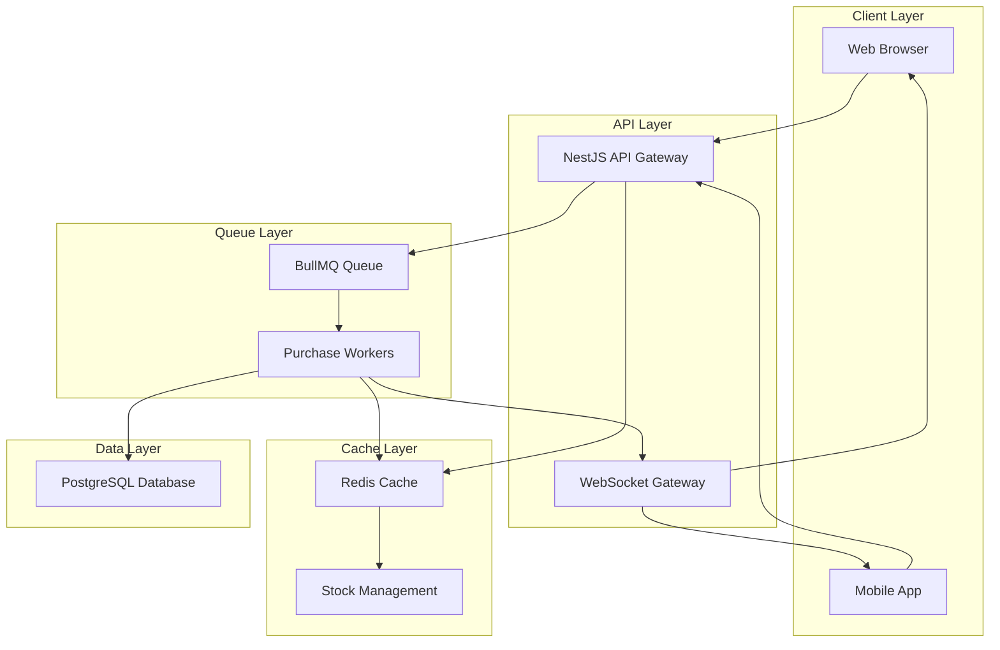
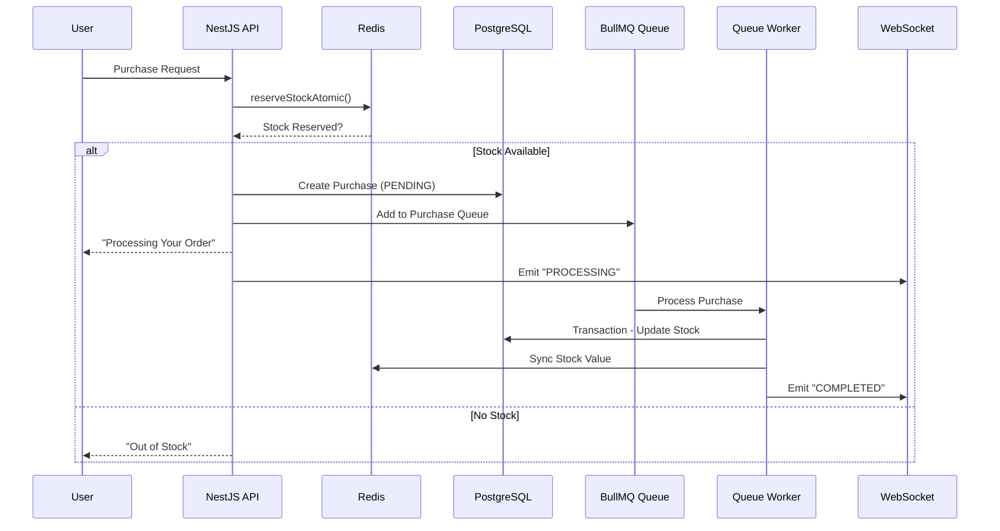
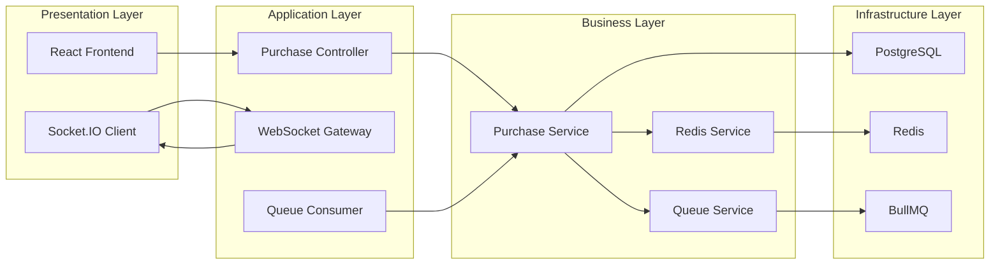
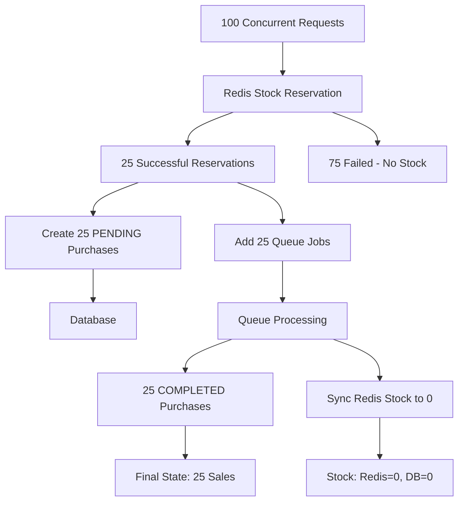

# Flash-Sale Backend

## 🎯 System Overview
A high-concurrency flash sale system built with NestJS, BullMQ, Redis, and PostgreSQL designed to handle thousands of simultaneous purchase requests while preventing overselling and maintaining data consistency.

## 🏗️ Architecture Design Choices

- Layered Architecture with Queue Processing
  - Choice:
    - API → Redis Reservation → Database → Queue Processing
  - Why:
      - Immediate Response: Users get instant feedback ("Processing")
      - Load Decoupling: HTTP layer offloads heavy processing to queues
      - Scalability: Queue workers can scale independently
      - Resilience: Failed purchases can be retried or handled gracefully
  - Trade-off:
    - Added complexity vs simple synchronous processing
        
- Redis for Stock Management
  - Choice:
    - Redis atomic operations for initial stock reservation
  - Why:
    - Atomic Operations: reserveStockAtomic uses Redis transactions
    - Performance: Sub-millisecond stock checks
    - Prevents Over-creation: Stops purchase record creation when stock exhausted
    - Real-time Updates: Live stock counter for UI
  - Trade-off:
    - Eventually consistent with DB (handled via synchronization)

- Database as Source of Truth
  - Choice:
    - PostgreSQL with Prisma for final stock validation
  - Why:
    - ACID Compliance: Database transactions ensure consistency
    - Data Integrity: Foreign keys, constraints prevent data corruption
    - Persistence: Survives restarts unlike in-memory solutions
    - Complex Queries: Easy reporting and analytics
  - Trade-off:
    - Slower than Redis but more reliable
    
- BullMQ for Queue Processing
  - Choice:
    - BullMQ over other queue systems
  - Why:
    - Redis-backed: Leverages existing Redis infrastructure
    - NestJS Integration: First-class support with @nestjs/bullmq
    - Retry Logic: Built-in job retries with exponential backoff
    - Monitoring: Built-in dashboard and metrics
    - Concurrency Control: Configurable worker concurrency
  - Trade-off:
    - Redis dependency vs message broker like RabbitMQ
 
---


## 🏗️ System Architecture Diagram



## Data Flow Sequence

## 🏗️ Component Architecture


## ⚡ Concurrency Handling


## 📝 Project setup

```bash
# Install Packages
npm install # or yarn

# Run the project
npm run dev # or yarn dev

# Build the project
npm run build # or yarn build
```

---

### Running the Stress Tests
```bash
# stress
npm run test:stress #or yarn test:stress
```

```yaml
✅ Stress Test Results:
- Requests Count: 100
- Failed/Out of Stock: 30-40 (correctly rejected)
- Order Processed: 50-70 (Redis reservations)
- Order Success: 25 (EXACTLY - no overselling)
- Stock-Redis: 0 (perfect sync)
- Stock-DB: 0 (perfect sync)
- Sold: 25 (Match with assigned task)
```

### Other test
```bash
# promo
npm run test:promo #or yarn test:promo

# purchase
npm run test:purchase #or yarn test:purchase

# integration
npm run test:integration #or yarn test:integration
```
